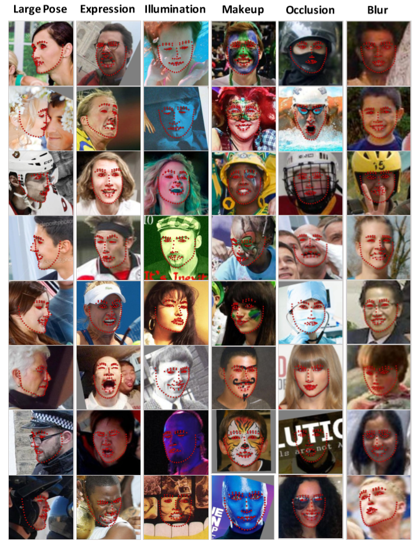

# Data augmentation design

This document explains how the WFLW<sup><a href="#ref-1">[1]</a></sup> dataset is formatted, how to perform data augmentation on that dataset and how to write the resulting dataset to .h5 files, so that it can be used with Caffe.

Data augmentation increases the size of the dataset by generating multiple alterations of the dataset. For images this can mean mirroring, rotating, shearing, cropping, translating, scaling, color transformations, adding noise, removing parts of an image, etcetera. Because the dataset is larger and more diverse after augmentation, the degree to which the network will overfit is likely to be reduced. This increases the neural networks performance on data that was not seen during the training process.

For information on how to use the data augmentation scripts, refer to [data_augmentation_readme.md](data_augmentation_readme.md)

## The WFLW dataset

The WFLW dataset contains 7500 training images and 2500 test images. Each image contains one face that is annotated with 98 different landmarks. These landmarks can be seen in [figure 1](#figure-1)

<a id="figure-1">
    <figure>
        <a href="https://wywu.github.io/projects/LAB/support/WFLW_annotation.png">
            
        </a>
        <figcaption>Figure 1<sup><a href="#ref-1">[1]</a></sup>: Image showing the landmark locations in the WFLW dataset.</figcaption>
    </figure>
</a>


The WFLW images are contained in the subdirectories of the `WFLW_images` directory. The annotations of the images are contained in `list_98pt_rect_attr_test.txt` (test images) and `list_98pt_rect_attr_train.txt` (training images) along with the path to the corresponding images relative to the WFLW_images directory. For instance: This is the first line of `list_98pt_rect_attr_test.txt`:

```
182.212006 268.895996 184.231026 278.555935 186.344894 288.195481 188.648177 297.791365 191.233207 307.314980 194.196268 316.727393 197.675303 325.960683 201.824785 334.911467 206.775736 343.443634 212.673605 351.346740 219.837267 358.105834 228.194810 363.337202 236.455534 368.705138 243.563716 375.542218 250.925174 382.088737 259.777004 386.346261 269.549779 387.049878 278.298328 384.082885 285.392740 378.152167 291.378812 371.043838 297.780969 364.309057 304.312919 357.698462 310.447236 350.719653 315.930044 343.220593 320.511995 335.141825 324.051533 326.554428 326.568105 317.613186 328.390492 308.500061 330.612962 299.479998 333.487774 290.642392 335.713065 281.622785 337.163003 272.444467 338.227692 263.212006 210.138992 300.615997 222.644974 297.890961 235.363983 298.151978 246.942978 299.391968 257.441010 300.830994 257.611969 304.799957 246.900986 303.914001 235.179001 302.840973 222.606995 301.989990 285.806976 299.045990 295.512970 296.641968 304.544983 294.989014 314.121979 293.123962 323.378967 294.755005 314.194977 296.925964 304.505981 299.115967 295.472961 300.877960 285.771973 302.760956 269.851013 311.436005 269.770491 323.194979 269.382674 334.941630 270.491228 346.539181 253.042007 348.842987 261.490088 352.218771 270.379219 353.896457 277.935988 351.521132 284.542816 347.006134 226.742996 309.906006 232.584430 309.309438 238.440116 308.886997 245.457800 309.204711 252.335205 310.658722 245.617587 313.049272 238.509980 313.282636 232.535767 311.923110 284.890991 308.625000 291.685625 306.388967 298.740838 305.278426 304.445725 305.487436 310.095642 306.337067 304.749064 308.523762 299.148337 309.907617 291.962007 309.990723 246.033005 359.019501 255.168831 361.639041 264.404187 363.931053 269.706619 363.652676 274.989326 361.242112 280.950560 358.649372 286.599365 355.433472 283.359979 363.478759 277.741016 370.000529 269.582112 372.667721 260.176963 371.396279 252.116800 366.373531 247.076996 359.700012 258.005929 364.209840 269.620318 365.757483 278.627904 362.436113 286.014526 356.210266 279.413487 364.753998 269.432083 368.638642 257.285470 366.731658 238.453801 311.748538 299.024561 308.745029 198 242 331 385 0 0 0 0 0 0 37--Soccer/37_Soccer_soccer_ball_37_45.jpg
```

Here the first number is the x coordinate of point one, the second number is the y coordinate of point one, the third number is the x coordinate of point two, the 196th number is the y coordinate of point 98. The coordinate system of these coordinates is illustrated in [figure 2](#figure-2).

<a id="figure-2">
    <figure class="image">
        <a href="https://tspp.files.wordpress.com/2009/10/cvcoordinate.png">
        
        </a><figcaption>Figure 2<sup><a href="#ref-2">[2]</a></sup>: Coordinate system used in WFLW dataset and OpenCV.</figcaption>
    </figure>
</a>

The next entries are:

* 197th: X coordinate of the upper left-hand coordinate of the bounding box of the face.
* 198th: Y coordinate of the upper left-hand coordinate of the bounding box of the face.
* 199th: X coordinate of the lower right-hand coordinate of the bounding box of the face.
* 200th: Y coordinate of the lower right-hand coordinate of the bounding box of the face.
* 201st: Is 1 when the image shows the side of the face, 0 otherwise. This is also known as large pose.
* 202nd: Is 1 when the image shows a face with a challenging expression, 0 otherwise.
* 203rd: Is 1 when the image was taken under challenging illumination, 0 otherwise.
* 204th: Is 1 when the person in the image is wearing makeup, 0 otherwise.
* 205th: Is 1 when the face in the image is occluded by something, 0 otherwise.
* 206th: Is 1 when the image is blurry, 0 otherwise.
* 207th: Path to the image relative to the WFLW_images folder.

<a id="figure-3">
    <figure class="image">
        <a href="WFLW.png">
        
        </a><figcaption>Figure 3<sup><a href="#ref-3">[3]</a></sup>: Examples of Large Pose, Expression, Illumination, Makeup, Occlusion and Blur in the WFLW dataset.</figcaption>
    </figure>
</a>

## Design

### Global design

Each image and its landmarks will first be randomly mirrored, rotated, translated and scaled. The amount by which this is done is randomly determined following a predefined uniform distribution. The reason this is done randomly is such that every image is augmented differently. This will allow for a highly varied dataset, without it being excessively large. Mirroring, rotation, translation and scaling were chosen, because the developers of the WFLW dataset also used these augmentations when training their neural network<sup><a href="#ref-3">[3]</a></sup>.

Data augmentation procedes as follows:
<a id="1-through-11"></a>

1. A single full image is loaded at a time. This will reduce RAM usage.
2. The images and landmarks are randomly mirrored or not mirrored around the central x line of the image.
3. The images and landmarks are randomly rotated. Mirroring precedes rotation, because mirroring does not increase the size of the image, whereas rotation does.
4. The bounding box of the face is determined from the facial landmarks. The bounding boxes provided by the WFLW dataset are not used, because at large angles of rotation, the provided bounding boxes are no longer accurate.
5. The bounding boxes are randomly translated in both the x and the y dimensions. The image and landmarks are not translated, but the bounding box is. This has the same effect as translation of the image and landmarks, but is less compute intensive. The amount by which the bounding boxes are translated is defined as a percentage of the dimensions of the bounding box. This makes translation independent of image size.
6. The bounding boxes are randomly scaled in both the x and the y dimensions.  The image and landmarks are not scaled, but the bounding box is. This has the same effect as scaling the image and landmarks, but is less compute intensive. Scaling is also done as a percentage of the dimensions of the bounding box.
7. The bounding boxes are clipped. That is, if the bounding box has coordinates that lie outside the image, The bounding boxes are clipped, such that all coordinates lie inside the image.
8. The landmarks are projected to the bounding box. The landmarks in the WFLW dataset are defined as coordinates in the original image. This will not mean anything to a neural network, because the network will not see the original image. Instead the coordinates should be defined by their position in the bounding box. To do this, the center position of the bounding box is subtracted from every landmark, after which the x and y coordinates of the landmarks are divided by the width and the height of the bounding box.
9. The image is cropped by the bounding box.
10. The cropped image is resized to the input dimensions of the neural network.
11. The image and landmarks are written to arrays of images and landmarks.
<a id="12-and-13"></a>

12. Once the arrays are full, the arrays are shuffled. This ensures the data is randomly ordered, which will improve training.
13. The arrays are written to .h5 files.

To make data augmentation more manageable, the classes `BBox` and `LandmarkDataUnit` are created. A `LandmarkDataUnit` object holds the image, landmarks and bounding box during the augmentation process. The bounding box in turn is a `BBox` object. The `LandmarkDataUnit` class defines functions for mirroring, rotation, bounding box creation, translation, scaling, clipping, projecting the image landmarks to the bounding box and cropping. The translate and scale functions of the `LandmarkDataUnit` class make use of translate and scale functions defined in the `BBox` class.

Steps [1 through 11](#1-through-11) are encapsulated in the `run` function of a `Threading.Thread` class `GenerateDataThread`. This will allow the data augmentation process to be executed across multiple threads, significantly accelerating this process.

These threads are created in the `GenerateDataset` function. This function also handles the creation of the arrays that hold the images and landmarks as well as steps [12 and 13](#12-and-13).

## References

<a id="ref-1"></a>\[1\]: Source: [https://wywu.github.io/projects/LAB/WFLW.html](https://wywu.github.io/projects/LAB/WFLW.html)

<a id="ref-2"></a>\[2\]: Source: [https://tspp.wordpress.com/2009/10/19/x-y-coordinate-system-on-opencv/](https://tspp.wordpress.com/2009/10/19/x-y-coordinate-system-on-opencv/)

<a id="ref-3"></a>\[3\]: Source: [https://wywu.github.io/projects/LAB/support/LAB_Supplementary_Material.pdf](https://wywu.github.io/projects/LAB/support/LAB_Supplementary_Material.pdf)
