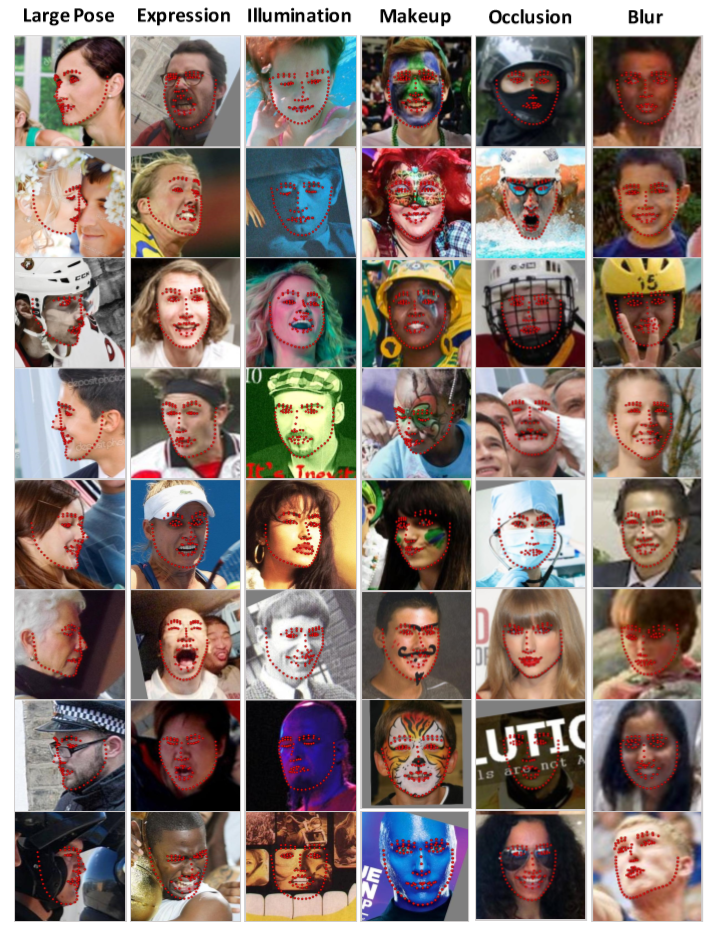

# Datasets

This document explains how the different datasets used to train the neural network are formatted. The datasets used are the [98 landmark WFLW dataset](https://wywu.github.io/projects/LAB/WFLW.html) and [ibugs 68 landmark datasets](https://ibug.doc.ic.ac.uk/resources/facial-point-annotations/).

## WFLW dataset

The WFLW dataset contains 7500 training images and 2500 test images. Each image contains one face that is annotated with 98 different landmarks. These landmarks can be seen in [figure 1](#figure-1)

<a id="figure-1">
    <figure>
        <a href="https://wywu.github.io/projects/LAB/support/WFLW_annotation.png">
            
        </a>
    </figure>
</a>

Figure 1<sup><a href="#ref-1">[1]</a></sup>: Image showing the landmark locations in the WFLW dataset.

The WFLW images are contained in the subdirectories of the `WFLW_images` directory. The annotations of the images are contained in `list_98pt_rect_attr_test.txt` (test images) and `list_98pt_rect_attr_train.txt` (training images) along with the path to the corresponding images relative to the WFLW_images directory. For instance: This is the first line of `list_98pt_rect_attr_test.txt`:

```
182.212006 268.895996 184.231026 278.555935 186.344894 288.195481 188.648177 297.791365 191.233207 307.314980 194.196268 316.727393 197.675303 325.960683 201.824785 334.911467 206.775736 343.443634 212.673605 351.346740 219.837267 358.105834 228.194810 363.337202 236.455534 368.705138 243.563716 375.542218 250.925174 382.088737 259.777004 386.346261 269.549779 387.049878 278.298328 384.082885 285.392740 378.152167 291.378812 371.043838 297.780969 364.309057 304.312919 357.698462 310.447236 350.719653 315.930044 343.220593 320.511995 335.141825 324.051533 326.554428 326.568105 317.613186 328.390492 308.500061 330.612962 299.479998 333.487774 290.642392 335.713065 281.622785 337.163003 272.444467 338.227692 263.212006 210.138992 300.615997 222.644974 297.890961 235.363983 298.151978 246.942978 299.391968 257.441010 300.830994 257.611969 304.799957 246.900986 303.914001 235.179001 302.840973 222.606995 301.989990 285.806976 299.045990 295.512970 296.641968 304.544983 294.989014 314.121979 293.123962 323.378967 294.755005 314.194977 296.925964 304.505981 299.115967 295.472961 300.877960 285.771973 302.760956 269.851013 311.436005 269.770491 323.194979 269.382674 334.941630 270.491228 346.539181 253.042007 348.842987 261.490088 352.218771 270.379219 353.896457 277.935988 351.521132 284.542816 347.006134 226.742996 309.906006 232.584430 309.309438 238.440116 308.886997 245.457800 309.204711 252.335205 310.658722 245.617587 313.049272 238.509980 313.282636 232.535767 311.923110 284.890991 308.625000 291.685625 306.388967 298.740838 305.278426 304.445725 305.487436 310.095642 306.337067 304.749064 308.523762 299.148337 309.907617 291.962007 309.990723 246.033005 359.019501 255.168831 361.639041 264.404187 363.931053 269.706619 363.652676 274.989326 361.242112 280.950560 358.649372 286.599365 355.433472 283.359979 363.478759 277.741016 370.000529 269.582112 372.667721 260.176963 371.396279 252.116800 366.373531 247.076996 359.700012 258.005929 364.209840 269.620318 365.757483 278.627904 362.436113 286.014526 356.210266 279.413487 364.753998 269.432083 368.638642 257.285470 366.731658 238.453801 311.748538 299.024561 308.745029 198 242 331 385 0 0 0 0 0 0 37--Soccer/37_Soccer_soccer_ball_37_45.jpg
```

Here the first number is the x coordinate of point 0, the second number is the y coordinate of point 0, the third number is the x coordinate of point 1, the 196th number is the y coordinate of point 97. The coordinate system of these coordinates is illustrated in [figure 2](#figure-2).

<a id="figure-2">
    <figure class="image">
        <a href="https://tspp.files.wordpress.com/2009/10/cvcoordinate.png">
            
        </a>
    </figure>
</a>

Figure 2<sup><a href="#ref-2">[2]</a></sup>: Coordinate system used in WFLW  and 68 landmark ibug datasets as well as OpenCV.

The next entries are:

* 197th: X coordinate of the upper left-hand coordinate of the bounding box of the face.
* 198th: Y coordinate of the upper left-hand coordinate of the bounding box of the face.
* 199th: X coordinate of the lower right-hand coordinate of the bounding box of the face.
* 200th: Y coordinate of the lower right-hand coordinate of the bounding box of the face.
* 201st: Is 1 when the image shows the side of the face, 0 otherwise. This is also known as large pose.
* 202nd: Is 1 when the image shows a face with a challenging expression, 0 otherwise.
* 203rd: Is 1 when the image was taken under challenging illumination, 0 otherwise.
* 204th: Is 1 when the person in the image is wearing makeup, 0 otherwise.
* 205th: Is 1 when the face in the image is occluded by something, 0 otherwise.
* 206th: Is 1 when the image is blurry, 0 otherwise.
* 207th: Path to the image relative to the WFLW_images folder.

<a id="figure-3">
    <figure class="image">
        <a href="./images/wflw.png">
            
        </a>
    </figure>
</a>

Figure 3<sup><a href="#ref-3">[3]</a></sup>: Examples of attributes Large Pose, Expression, Illumination, Makeup, Occlusion and Blur in the WFLW dataset.

## Ibug 68 landmark dataset

The ibug 68 landmark dataset is a collection of preexisting datasets reannotated with 68 landmark points along with a new 68 landmark dataset 300W provided by ibug. The other datasets are XM2VTS, FRGC Ver.2, LFPW, HELEN, AFW and IBUG. These datasets can be downloaded from [ibugs site](https://ibug.doc.ic.ac.uk/resources/facial-point-annotations/), however XM2VTS and FRGC Ver.2 are not publicly available, so for these only the annotations are provided. Excluding XM2VTS and FRGC Ver.2, this leaves a total of 4437 annotated images. The FRGC and XM2VTS folders contain annotations for an extra 4950 and 2360 images respectively. With access to these datasets, this would bring the total up to 11747 annotated images. The 68 landmarks in this dataset are illustrated in [figure 4](#figure-4).

<a id="figure-4">
    <figure class="image">
        <a href="https://ibug.doc.ic.ac.uk/media/uploads/images/annotpics/figure_68_markup.jpg">
            
        </a>
    </figure>
</a>

Figure 4<sup><a href="#ref-4">[4]</a></sup>: 68 landmarks provided by ibug 68 landmark dataset.

The 68 landmark dataset does not use a centralized file with all the annotations. Instead every image file is associated with a similarly named .pts file. For example if an image is named indoor_001.png, the corresponding .pts file is named indoor_001.pts. These .pts files contain the annotations for each image. The following shows an example of a .pts file.

```
version: 1
n_points: 68
{
446.000 91.000
449.459 119.344
450.957 150.614
460.552 176.986
471.486 202.157
488.087 226.842
506.016 246.438
524.662 263.865
553.315 271.435
578.732 266.260
599.361 248.966
615.947 220.651
627.439 197.999
635.375 179.064
642.063 156.371
647.302 124.753
646.518 92.944
470.271 117.870
486.218 109.415
503.097 114.454
519.714 120.090
533.680 127.609
571.937 123.590
585.702 117.155
602.344 109.070
620.077 103.951
633.964 111.236
554.931 145.072
554.589 161.106
554.658 177.570
554.777 194.295
532.717 197.930
543.637 202.841
555.652 205.483
565.441 202.069
576.368 197.061
487.474 136.436
499.184 132.337
513.781 133.589
527.594 143.047
513.422 144.769
499.117 144.737
579.876 140.815
590.901 130.008
605.648 128.376
618.343 132.671
606.771 140.525
593.466 141.419
519.040 229.040
536.292 221.978
547.001 221.192
557.161 224.381
568.172 219.826
579.144 222.233
589.098 224.410
581.071 239.804
570.103 251.962
558.241 254.844
547.661 254.621
534.085 247.772
524.758 230.477
547.684 231.663
557.304 230.805
568.172 229.159
585.417 225.992
569.211 237.777
557.473 240.542
547.989 240.014
}
```

Here lines 4 to 71 contain the x and y coordinates of the landmarks of the image. These coordinates also follow the coordinate system depicted in [figure 2](#figure-2).

## References

<a id="ref-1"></a>\[1\]: Source: [https://wywu.github.io/projects/LAB/WFLW.html](https://wywu.github.io/projects/LAB/WFLW.html)

<a id="ref-2"></a>\[2\]: Source: [https://tspp.wordpress.com/2009/10/19/x-y-coordinate-system-on-opencv/](https://tspp.wordpress.com/2009/10/19/x-y-coordinate-system-on-opencv/)

<a id="ref-3"></a>\[3\]: Source: [https://wywu.github.io/projects/LAB/support/LAB_Supplementary_Material.pdf](https://wywu.github.io/projects/LAB/support/LAB_Supplementary_Material.pdf)

<a id="ref-4"></a>\[4\]: Source: [https://ibug.doc.ic.ac.uk/resources/facial-point-annotations/](https://ibug.doc.ic.ac.uk/resources/facial-point-annotations/)
