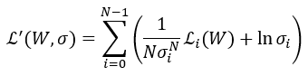
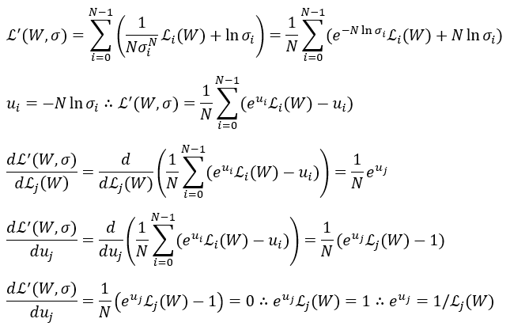
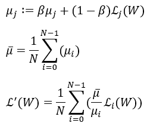

# Design of the neural network

## [VanillaCNN](https://github.com/ishay2b/VanillaCNN)

The design of the neural network is inspired by VanillaCNN.

The steps VanillaCNN uses to produce the landmark results are as follows:

1. VanillaCNN uses an external face detector to detect the faces present in an image. This face detector generates bounding boxes for every detected face.
2. The bounding boxes are used to crop the original image. Each cropped image is resized and fed to the VanillaCNN neural network.
3. VanillaCNN predicts the location of the facial landmarks, relative to the bounding box.
4. The facial landmarks predicted by the neural network are projected to the coordinate system of the original image. The landmarks can now be overlayed on top of the original image.

VanillaCNN detects 5 facial landmarks (left pupil, right pupil, nose, left mouth corner, right mouth corner) and is trained on the MTFL, AFLW and AFW datasets. VanillaCNN uses a convolutional neural network with an input size of 40 by 40 pixels. Each convolutional layer is followed by a hyperbolic tangent layer, an absolute value layer and a pooling layer. The network consists of a total of 4 convolutional layers, followed by 2 fully connected layers. The last fully connected layer has 10 outputs. These are the x and y coordinates of every landmark. For training mean squared error loss is used. This mean squared error loss is divided by the interocular distance to normalize for different sized faces.

## 98 landmark design

The 98 landmark network is designed to be run on the DEEPHi DPU. Because the DPU as of yet does not support the tanh function, the tanh and absolute value units in the VanillaCNN network were replaced by the ReLU activation function. ReLU is also less computationally expensive and can be faster to train due to the gradient being non-zero for a larger part of the activation function. The network was retrained to confirm its function. This reduced the testing loss of the neural network from 0.022 to 0.019. To try to improve the spatial resolution of the neural network, the network was redesigned with dilated convolutions instead of pooling layers. This further improved the testing loss of the network from 0.019 to 0.011.

This 5 landmark design was scaled up to a 98 landmark design. The input was changed to a size of 80 by 80. Since the 98 landmark network must predict 98 x and 98 y coordinates, the 10 output fully connected layer was replaced by a 196 output fully connected layer. To try to improve the performance of the model after quantization, the model was trained with added noise. This noise is generated as a uniform distribution with a mean of 1.0 and a maximum absolute deviation of 0.010. The noise is then multiplied by the outputs of the ReLU layers. The deviation of this noise can be increased to increase regularization, or decreased to allow the network to converge to a lower training loss.

To get more data, the 68 landmark datasets from ibug are also used during training. Because these landmarks are not a subset of the WFLW dataset, an extra top layer is added to the model. This top layer is only used during training. The other layers of the network are shared with the 98 landmark top layer. This increases the training set size from 7500 to 11936. Similarly more datasets can be addded to further increase the dataset size.

To further reduce testing loss, the neural network is also trained to predict the attribute flags provided by the WFLW dataset. This is done by adding another fully connected layer with a sigmoid activation function for each of the attribute flags. The neural network can use the knowledge it learns from these attribute flags to get better at predicting landmark locations. This is called multitask learning.

All of the top layers use a Euclidean loss layer. The outputs of these loss layers are fed to a custom layer, which averages each loss over multiple iterations using an exponentially weighted average. The derivative of each of the loss layers is set to the average of all of the exponentially weighted averages, divided by each of the individual exponentially weighted averages. This should cause each loss layer to converge at approximately the same rate. 

The idea behind this layer was obtained from https://arxiv.org/abs/1705.07115. This paper proposes a layer which adapts the learning rates of the top layers in a multitask neural network to let the neural network converge more optimally on each of the tasks it is trained for. To do this the following adjusted loss function is used:

<a id="figure-1">
    <figure class="image">
        
    </figure>
</a>

This new loss function has extra learnable parameters sigma, which like the weights of the neural network are optimized to minimize this loss function. 

From this loss function we derive:

<a id="figure-3">
    <figure class="image">
        
    </figure>
</a>

This shows that the derivative of the weight of each loss function is zero as long as the weight is equal to 1/L. This stationary point is a minimum and therefore stable if the corresponding loss function is greater than zero. Because this weight is only updated slightly on every update, this has the effect of dividing each loss by its average. Instead of learning this average, the layer used in this neural network just directly calculates the average using an exponentially weighted average.

However, when dividing the current loss by its average, the resultant adjusted loss will remain approximately one and will not decrease as training progresses. To counteract this, each lossweight is multiplied by the average of all of the exponentially weighted averages. All in all this results in the following:

<a id="figure-3">
    <figure class="image">
        
    </figure>
</a>

This is implemented in the python layer [MultitaskLoss_2](../python/MultitaskLoss_2.py). The python layer [MultitaskLoss](../python/MultitaskLoss.py) is similar to [MultitaskLoss_2](../python/MultitaskLoss_2.py), but uses learned parameters like in the original paper instead of an exponentially weighted average.

&nbsp;

At first only dilated convolutions were used to reduce the height and width of the neural network. No strided or padded convolutions were used. This resulted in a network with a reasonable accuracy, but the network was fairly slow to train. This seemed to be because a high dilation rate causes training to slow down.

To try to find a well performing model, multiple different neural network architectures were tried. The best performing models used same padding in almost every layer and used strided convolutions to reduce the height and width of the neural network. The strided convolutions used a filter kernel of size 2 by 2 with a stride of 2, whereas the other layers used filter kernels of size 3 by 3 with a stride of 1. Once the height and width of the network got as low as 5 by 5, no padding was used and the height and width of the neural network were further reduced to 1 by 1 using 3 by 3 convolutions. All fully connected layers are connected to this 1 by 1 layer. Each hidden layer uses a ReLU activation function.

Including the network that only uses dilated convolutions, this resulted in a total of 3 different neural network models. one with 11 layers, one with 12 layers and one with 15 layers. The 12 layer neural network is the one utilizing dilated convolutions. The structure of these neural networks is illustrated in figure 1, figure 2 and figure 3.
